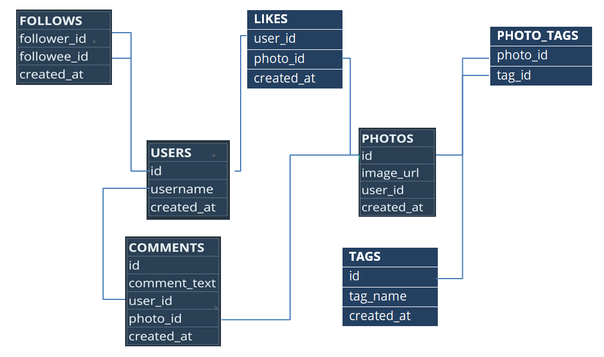
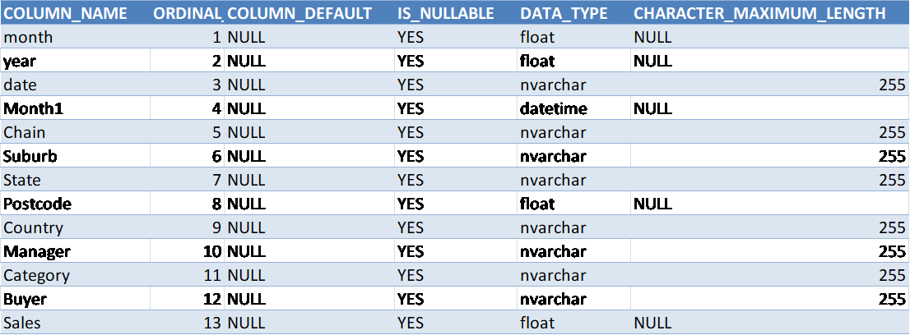
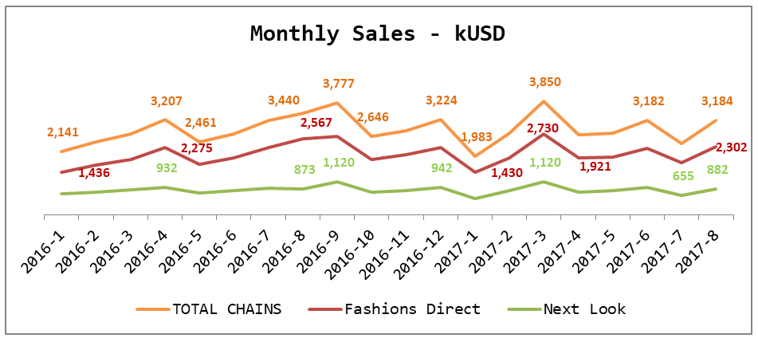
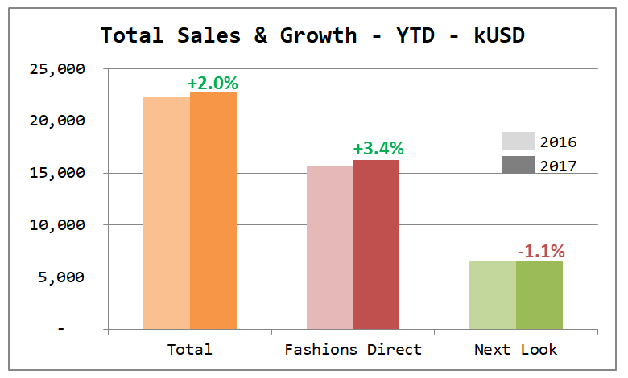
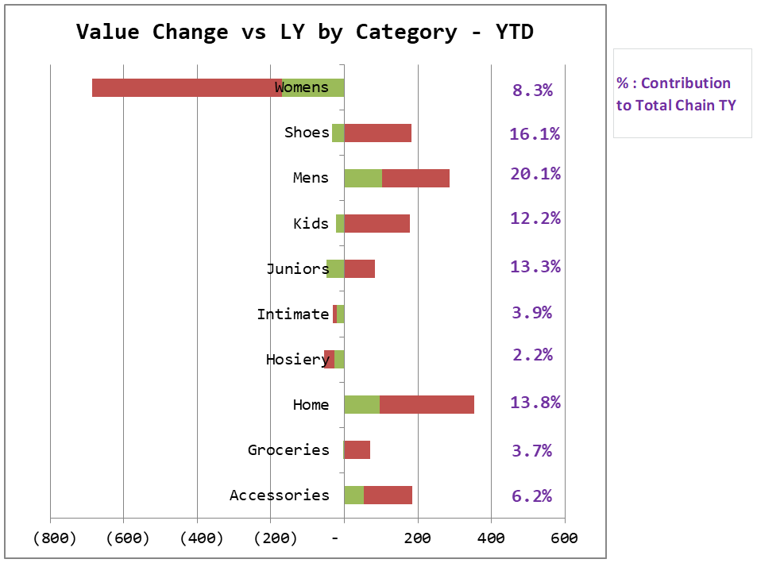
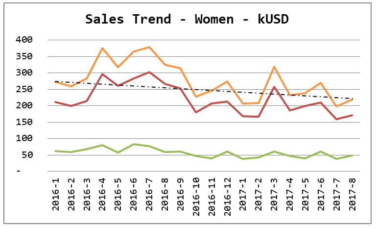
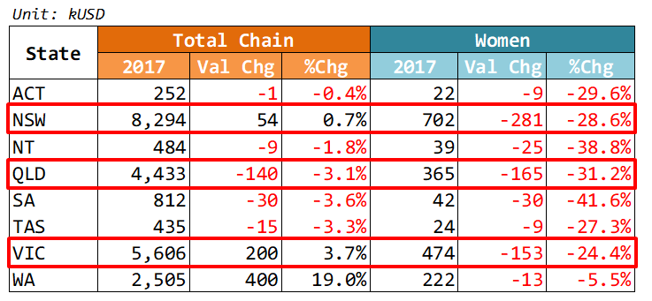

# Project with SQL (MySQL, SQL Server) & Excel for Data Analysis & Visualization

These are exercises to practice and enhance my self-learn SQL skills and advanced Excel.

# Exercises 1:
  Working on Instagram's clone database (100 users), with 7 relational tables, using MySQL to answer business requirements
  
  Table schema is as follows: 
  
  
  
  
   1/ Find out Total users we are having on our database:
  
    SELECT COUNT(*) AS total_users
    FROM users;
   
  
  2/ Find out Top 5 users that have most followees:
  
    SELECT users.username, follows.follower_id, COUNT(*) as total
    FROM follows
    INNER JOIN users ON users.id = follows.follower_id
    GROUP BY follows.follower_id
    ORDER BY total DESC LIMIT 5;
    
    
  3/ Find out Top 5 period hours that have most interation:
  
    SELECT HOUR(created_at) AS hour, COUNT(*) AS total 
    FROM likes 
    GROUP BY hour 
    ORDER BY total DESC LIMIT 5;
    
  4/ Find out Top 10 photos with specific hashtags, the users who posted those photos and the following likes (for ex: to identify the winners of a marketing contest). 
  In this case we use 2 hashtags: fun (id: 13), party (id: 17) 

    SELECT users.username, photos.id, photos.image_url,
           COUNT(likes.created_at) AS total_likes, photo_tags.tag_id
    FROM photos
    JOIN users ON users.id = photos.user_id 
    JOIN likes ON photos.id = likes.photo_id
    JOIN photo_tags ON photo_tags.photo_id = photos.id
    WHERE photo_tags.tag_id IN (13,17)
    GROUP BY photos.id 
    ORDER BY total_likes DESC LIMIT 10;
    
  5/ Count the percentage of users who have never commented or commented on every photo
  (for ex: to cluster our customers and see the portion of each group)

- Percentage of users that have never commented:

        SELECT ( SELECT ( (
                SELECT COUNT(*) FROM users 
                WHERE users.id NOT IN 
                    ( SELECT comments.user_id FROM comments	
                      GROUP BY comments.user_id ) )
                    ) / 
                ( SELECT COUNT(*) FROM users) ) * 100 AS percent_no_cmt ; 
 
 - Percentage of users that have commented on every photo: 
 
        SELECT COUNT(*) FROM comments ;
    --> to see how many comments there are in our database, then use that number to calculate the user (in this case: *14976* comments)

        SELECT ( SELECT ( (	
                SELECT COUNT(*) FROM users 
                WHERE users.id IN 
                 ( SELECT user_id FROM comments HAVING COUNT(id) = 14976 ) )  ) )    / 
        ( SELECT COUNT(*) FROM users) ) * 100 AS percent_cmt_all ; 

# Exercise 2:
  Working on fake database *"sample_data"* with one table called *"sample"* (~76,930 rows) about Sales of a Fashion Company with following facts: 

> (1)	Data period: 2016-01-01 to 2017-08-01.

> (2)	This company has 2 chains: Fashion Direct & Next Look

> (3)	Operates in Australia

Table schema is as below:

How I do the analysis:
>First, to evaluate company's performance, we see company sales trend and growth TY vs LY by comparing 2 similar periods.

>Then, we spot out the abnormal chain/category/products... that are slowing down the growth.

>After knowing the problems, we dig deeper in the data to see what is really hapenning there,  figure out why and propose recommendations.

I use SQL Server to explore, query data and export to Excel. Then do some other analysis and visualization in Excel to build the whole report

- Sales trend:

		SELECT	CONCAT(YEAR([sample].[Month1]),'-', MONTH([sample].[Month1]) AS [date],
                [sample].[Chain],
                SUM([sample].[Sales])/1000 AS monthly_sales_kUSD
		FROM [sample]
		GROUP BY YEAR([sample].[Month1]),
                 MONTH([sample].[Month1]),[sample].[Chain]
		ORDER BY [sample].[Chain],
                 YEAR([sample].[Month1]), MONTH([sample].[Month1]);
				 
        
- Sales growth: 

        
        SELECT YEAR([sample].[Month1]) AS year, 
               ROUND(SUM([sample].[sales])/1000,2) AS sales_8_months
        FROM [sample]
        WHERE MONTH([sample].[Month1]) IN (1,2,3,4,5,6,7,8)
        GROUP BY YEAR([sample].[Month1]);
		
		
        
- Value Change vs LY by Category - YTD:

		SELECT [sample].[Chain], [sample].[Category], 
			   YEAR([sample].[Month1]) AS [year],   
			   SUM([sample].[sales])/1000 AS monthly_sales_kUSD
		FROM [sample]
		WHERE MONTH([sample].[Month1]) IN (1,2,3,4,5,6,7,8)
		GROUP BY [sample].[Chain], [sample].[Category],
                 YEAR([sample].[Month1])
		ORDER BY [sample].[Chain], [sample].[Category],
                 YEAR([sample].[Month1]);
                 
- Women sales trend and sales by states: 

		SELECT [sample].[State], YEAR([sample].[Month1]) AS [year], 
			   SUM([sample].[sales])/1000 AS monthly_sales_kUSD
		FROM [sample]
		WHERE MONTH([sample].[Month1]) IN (1,2,3,4,5,6,7,8)
		GROUP BY [sample].[State], YEAR([sample].[Month1])
		ORDER BY [sample].[State], YEAR([sample].[Month1]);

		SELECT [sample].[State], YEAR([sample].[Month1]) AS [year],
			   SUM([sample].[sales])/1000 AS monthly_sales_kUSD
		FROM [sample]
		WHERE [sample].[Category] LIKE 'Wome%'
			  AND MONTH([sample].[Month1]) IN (1,2,3,4,5,6,7,8)
		GROUP BY [sample].[State], YEAR([sample].[Month1])
		ORDER BY [sample].[State], YEAR([sample].[Month1]);
		

Results:

*From Jan to May17, sales trend is quite similar to LY. However, since Jun17, sales trend starts to fluctuates with sudden decrease, sales recovers in Jul but still lower than LY -7.4%, happened for both chains. 
Next Look is lacking behind with negative growth.*
	

*Women, accounts for 8.3% total chain, is the main category which is losing TY, with a loss around 686 kUSD (-26.6% vs LY). Other main categories are still growing, such as Men (+6.6%), Home (+12.6%) and Shoes (+4.2%).*

*From Jan16 till now, Women sales is decreasing since Sep16, has some uplifts during YTD17 but still lower vs LY, happened across States, most severe in NSW, QLD, VIC.*

	

